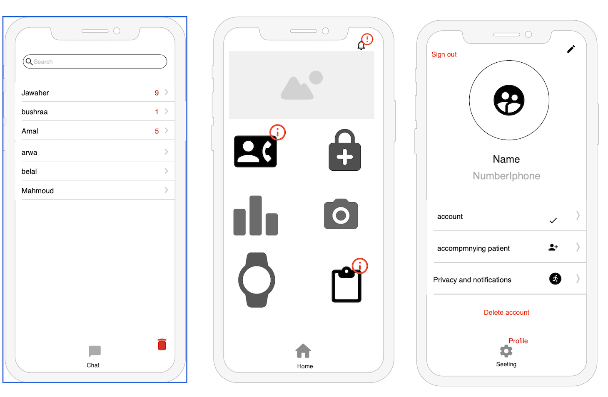

# lifeGlocuse

## Description
- It is a communication between the doctor and the patient, and it is a set of results that are measured by analyzing the blood through the device, and the number is entered to detect the state of blood sugar
 It also helps people with diabetes to identify the rates of rise and fall, and follow them on their sugar level.

## Demo

## User Story:

## Framework
- UIKit
- Firebase
- IQKeyboardManagerSwift
- Foundation

## Wireframe:

## Entity Relationship Diagram (ERD):

